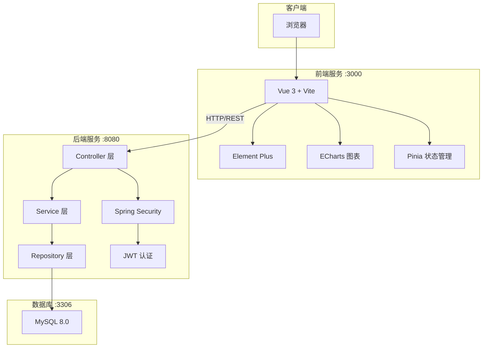
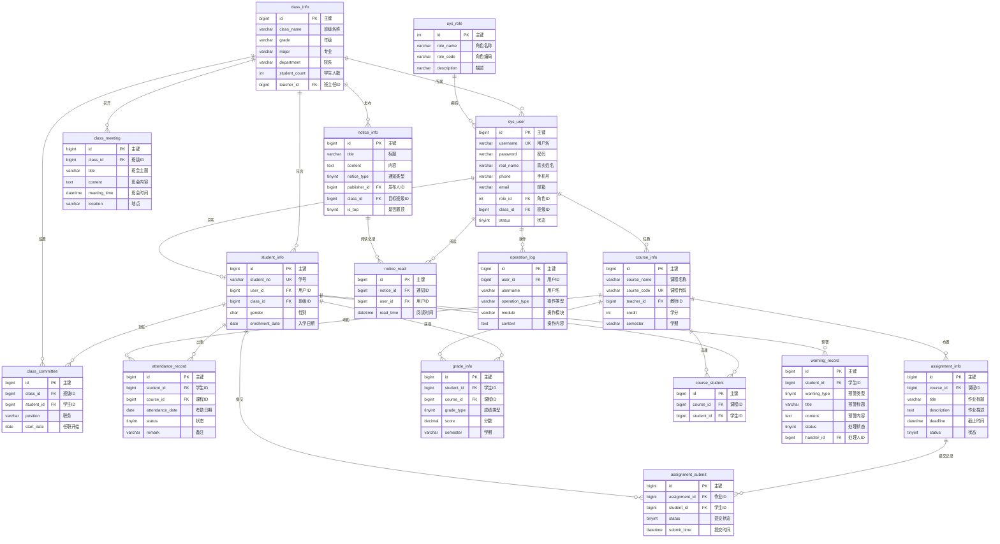

# 班级事务与学风管理系统 - 项目设计文档

## 一、系统架构



### 技术栈说明

| 层级 | 技术 | 版本 |
|------|------|------|
| 前端框架 | Vue 3 + Vite | 3.x |
| UI 组件库 | Element Plus | 2.x |
| 图表库 | ECharts | 5.x |
| 状态管理 | Pinia | 2.x |
| 后端框架 | Spring Boot | 3.2 |
| ORM 框架 | Spring Data JPA/Hibernate | 3.2 |
| 数据库 | MySQL | 8.0 |
| 认证方式 | JWT + RSA | - |

---

## 二、ER 图



---

## 三、接口清单

### 1. 认证模块 (AuthController)

| 方法 | 路径 | 说明 | 权限 |
|------|------|------|------|
| GET | `/api/auth/public-key` | 获取RSA公钥 | 公开 |
| POST | `/api/auth/login` | 用户登录 | 公开 |
| POST | `/api/auth/logout` | 用户登出 | 已登录 |
| GET | `/api/auth/info` | 获取当前用户信息 | 已登录 |
| PUT | `/api/auth/password` | 修改密码 | 已登录 |

### 2. 用户管理 (UserController)

| 方法 | 路径 | 说明 | 权限 |
|------|------|------|------|
| GET | `/api/users` | 分页查询用户列表 | ADMIN |
| GET | `/api/users/{id}` | 获取用户详情 | ADMIN |
| POST | `/api/users` | 新增用户 | ADMIN |
| PUT | `/api/users/{id}` | 修改用户 | ADMIN |
| DELETE | `/api/users/{id}` | 删除用户 | ADMIN |
| PUT | `/api/users/{id}/status` | 修改用户状态 | ADMIN |
| POST | `/api/users/{id}/reset-password` | 重置密码 | ADMIN |

### 3. 班级管理 (ClassController)

| 方法 | 路径 | 说明 | 权限 |
|------|------|------|------|
| GET | `/api/classes` | 分页查询班级列表 | 公开 |
| GET | `/api/classes/all` | 获取所有班级 | 公开 |
| GET | `/api/classes/{id}` | 获取班级详情 | 公开 |
| POST | `/api/classes` | 新增班级 | ADMIN/CLASS_TEACHER |
| PUT | `/api/classes/{id}` | 修改班级 | ADMIN/CLASS_TEACHER |
| DELETE | `/api/classes/{id}` | 删除班级 | ADMIN |
| GET | `/api/classes/{id}/students` | 获取班级学生列表 | ADMIN/CLASS_TEACHER/COURSE_TEACHER |
| GET | `/api/classes/{id}/contacts` | 获取班级通讯录 | 公开 |

### 4. 学生管理 (StudentController)

| 方法 | 路径 | 说明 | 权限 |
|------|------|------|------|
| GET | `/api/students` | 分页查询学生列表 | ADMIN/CLASS_TEACHER |
| GET | `/api/students/current` | 获取当前学生信息 | STUDENT |
| GET | `/api/students/{id}` | 获取学生详情 | 公开 |
| GET | `/api/students/all` | 获取所有学生 | 公开 |
| POST | `/api/students` | 新增学生 | ADMIN |
| PUT | `/api/students/{id}` | 修改学生 | ADMIN/CLASS_TEACHER |
| DELETE | `/api/students/{id}` | 删除学生 | ADMIN |

### 5. 课程管理 (CourseController)

| 方法 | 路径 | 说明 | 权限 |
|------|------|------|------|
| GET | `/api/courses` | 分页查询课程列表 | 公开 |
| GET | `/api/courses/all` | 获取所有课程 | 公开 |
| GET | `/api/courses/{id}` | 获取课程详情 | 公开 |
| POST | `/api/courses` | 新增课程 | ADMIN/COURSE_TEACHER |
| PUT | `/api/courses/{id}` | 修改课程 | ADMIN/COURSE_TEACHER |
| DELETE | `/api/courses/{id}` | 删除课程 | ADMIN |

### 6. 考勤管理 (AttendanceController)

| 方法 | 路径 | 说明 | 权限 |
|------|------|------|------|
| GET | `/api/attendances` | 分页查询考勤记录 | 公开 |
| GET | `/api/attendances/student/{studentId}` | 获取学生考勤记录 | 公开 |
| GET | `/api/attendances/course/{courseId}` | 获取课程考勤记录 | ADMIN/COURSE_TEACHER |
| POST | `/api/attendances` | 录入考勤 | ADMIN/COURSE_TEACHER |
| POST | `/api/attendances/batch` | 批量录入考勤 | ADMIN/COURSE_TEACHER |
| PUT | `/api/attendances/{id}` | 修改考勤 | ADMIN/COURSE_TEACHER |
| DELETE | `/api/attendances/{id}` | 删除考勤 | ADMIN/COURSE_TEACHER |
| GET | `/api/attendances/statistics/student/{studentId}` | 学生考勤统计 | 公开 |
| GET | `/api/attendances/statistics/class/{classId}` | 班级考勤统计 | ADMIN/CLASS_TEACHER |

### 7. 作业管理 (AssignmentController)

| 方法 | 路径 | 说明 | 权限 |
|------|------|------|------|
| GET | `/api/assignments` | 分页查询作业列表 | 公开 |
| GET | `/api/assignments/{id}` | 获取作业详情 | 公开 |
| POST | `/api/assignments` | 发布作业 | ADMIN/COURSE_TEACHER |
| PUT | `/api/assignments/{id}` | 修改作业 | ADMIN/COURSE_TEACHER |
| DELETE | `/api/assignments/{id}` | 删除作业 | ADMIN/COURSE_TEACHER |
| GET | `/api/assignments/{id}/submits` | 获取作业提交列表 | ADMIN/COURSE_TEACHER |
| POST | `/api/assignments/{id}/submits` | 记录作业提交 | ADMIN/COURSE_TEACHER |
| PUT | `/api/assignments/submits/{submitId}` | 更新提交状态 | ADMIN/COURSE_TEACHER |
| GET | `/api/assignments/student/{studentId}` | 获取学生作业列表 | 公开 |
| GET | `/api/assignments/statistics/class/{classId}` | 班级作业统计 | ADMIN/CLASS_TEACHER |

### 8. 成绩管理 (GradeController)

| 方法 | 路径 | 说明 | 权限 |
|------|------|------|------|
| GET | `/api/grades` | 分页查询成绩列表 | 公开 |
| GET | `/api/grades/student/{studentId}` | 获取学生成绩 | 公开 |
| GET | `/api/grades/course/{courseId}` | 获取课程成绩 | ADMIN/COURSE_TEACHER |
| POST | `/api/grades` | 录入成绩 | ADMIN/COURSE_TEACHER |
| POST | `/api/grades/batch` | 批量录入成绩 | ADMIN/COURSE_TEACHER |
| PUT | `/api/grades/{id}` | 修改成绩 | ADMIN/COURSE_TEACHER |
| DELETE | `/api/grades/{id}` | 删除成绩 | ADMIN/COURSE_TEACHER |
| GET | `/api/grades/statistics/student/{studentId}` | 学生成绩统计 | 公开 |
| GET | `/api/grades/statistics/class/{classId}` | 班级成绩统计 | ADMIN/CLASS_TEACHER |
| GET | `/api/grades/distribution/course/{courseId}` | 课程成绩分布 | ADMIN/COURSE_TEACHER |

### 9. 预警管理 (WarningController)

| 方法 | 路径 | 说明 | 权限 |
|------|------|------|------|
| GET | `/api/warnings` | 分页查询预警列表 | ADMIN/CLASS_TEACHER/STUDENT |
| GET | `/api/warnings/{id}` | 获取预警详情 | ADMIN/CLASS_TEACHER/STUDENT |
| GET | `/api/warnings/student/{studentId}` | 获取学生预警 | 公开 |
| GET | `/api/warnings/class/{classId}` | 获取班级预警 | ADMIN/CLASS_TEACHER |
| PUT | `/api/warnings/{id}/handle` | 处理预警 | ADMIN/CLASS_TEACHER |
| POST | `/api/warnings/generate` | 手动生成预警 | ADMIN/CLASS_TEACHER |
| GET | `/api/warnings/statistics/class/{classId}` | 班级预警统计 | ADMIN/CLASS_TEACHER |

### 10. 通知管理 (NoticeController)

| 方法 | 路径 | 说明 | 权限 |
|------|------|------|------|
| GET | `/api/notices` | 分页查询通知列表 | 公开 |
| GET | `/api/notices/{id}` | 获取通知详情 | 公开 |
| POST | `/api/notices` | 发布通知 | ADMIN/CLASS_TEACHER |
| PUT | `/api/notices/{id}` | 修改通知 | ADMIN/CLASS_TEACHER |
| DELETE | `/api/notices/{id}` | 删除通知 | ADMIN/CLASS_TEACHER |
| PUT | `/api/notices/{id}/top` | 置顶通知 | ADMIN/CLASS_TEACHER |
| PUT | `/api/notices/{id}/withdraw` | 撤回通知 | ADMIN/CLASS_TEACHER |
| POST | `/api/notices/{id}/read` | 标记已读 | 已登录 |
| GET | `/api/notices/{id}/read-status` | 获取阅读状态 | ADMIN/CLASS_TEACHER |
| GET | `/api/notices/unread-count` | 获取未读数量 | 已登录 |

### 11. 班委管理 (CommitteeController)

| 方法 | 路径 | 说明 | 权限 |
|------|------|------|------|
| GET | `/api/committees` | 获取所有班委 | 公开 |
| GET | `/api/classes/{classId}/committees` | 获取班级班委 | 公开 |
| POST | `/api/classes/{classId}/committees` | 新增班委 | ADMIN/CLASS_TEACHER |
| PUT | `/api/committees/{id}` | 修改班委 | ADMIN/CLASS_TEACHER |
| DELETE | `/api/committees/{id}` | 删除班委 | ADMIN/CLASS_TEACHER |

### 12. 班会管理 (MeetingController)

| 方法 | 路径 | 说明 | 权限 |
|------|------|------|------|
| GET | `/api/meetings` | 分页查询所有班会 | 公开 |
| GET | `/api/classes/{classId}/meetings` | 分页查询班级班会 | 公开 |
| GET | `/api/meetings/{id}` | 获取班会详情 | 公开 |
| POST | `/api/classes/{classId}/meetings` | 新增班会记录 | ADMIN/CLASS_TEACHER |
| PUT | `/api/meetings/{id}` | 修改班会记录 | ADMIN/CLASS_TEACHER |
| DELETE | `/api/meetings/{id}` | 删除班会记录 | ADMIN/CLASS_TEACHER |

### 13. 统计分析 (StatisticsController)

| 方法 | 路径 | 说明 | 权限 |
|------|------|------|------|
| GET | `/api/statistics/dashboard` | 获取仪表盘数据 | ADMIN/CLASS_TEACHER/COURSE_TEACHER |
| GET | `/api/statistics/attendance/trend` | 考勤趋势统计 | ADMIN/CLASS_TEACHER/COURSE_TEACHER |
| GET | `/api/statistics/grade/distribution` | 成绩分布统计 | ADMIN/CLASS_TEACHER/COURSE_TEACHER |
| GET | `/api/statistics/assignment/completion` | 作业完成率统计 | ADMIN/CLASS_TEACHER/COURSE_TEACHER |
| GET | `/api/statistics/study-style/class/{classId}` | 班级学风指标 | ADMIN/CLASS_TEACHER/COURSE_TEACHER |
| GET | `/api/statistics/study-style/student/{studentId}` | 学生学风指标 | 公开 |

### 14. 操作日志 (LogController)

| 方法 | 路径 | 说明 | 权限 |
|------|------|------|------|
| GET | `/api/logs` | 分页查询操作日志 | ADMIN |

---

## 四、UI/UX 规范

### 1. 色彩规范

| 类型 | 色值 | 用途 |
|------|------|------|
| 主色调 | `#409EFF` | 主要按钮、链接、选中状态 |
| 成功色 | `#67C23A` | 成功提示、正向操作 |
| 警告色 | `#E6A23C` | 警告提示、需注意状态 |
| 危险色 | `#F56C6C` | 错误提示、删除操作 |
| 信息色 | `#909399` | 次要信息、禁用状态 |
| 背景色 | `#F5F7FA` | 页面背景 |
| 卡片背景 | `#FFFFFF` | 卡片、弹窗背景 |
| 边框色 | `#EBEEF5` | 分割线、边框 |

### 2. 文字规范

| 类型 | 色值 | 用途 |
|------|------|------|
| 主要文字 | `#303133` | 标题、重要内容 |
| 常规文字 | `#606266` | 正文内容 |
| 次要文字 | `#909399` | 辅助说明 |
| 占位文字 | `#C0C4CC` | 输入框占位符 |

### 3. 字体规范

```css
font-family: -apple-system, BlinkMacSystemFont, 'Segoe UI', Roboto, 'Helvetica Neue', Arial, sans-serif;
```

| 类型 | 字号 | 用途 |
|------|------|------|
| 大号 | 18px | 页面标题 |
| 中号 | 16px | 卡片标题 |
| 基础 | 14px | 正文内容 |
| 小号 | 13px | 辅助文字 |
| 迷你 | 12px | 标签、提示 |

### 4. 间距规范

| 类型 | 尺寸 | 用途 |
|------|------|------|
| 迷你间距 | 4px | 紧凑元素间距 |
| 小间距 | 8px | 相关元素间距 |
| 基础间距 | 16px | 标准模块间距 |
| 中等间距 | 24px | 区块间距 |
| 大间距 | 32px | 页面区域间距 |

### 5. 圆角规范

| 类型 | 尺寸 | 用途 |
|------|------|------|
| 小圆角 | 4px | 按钮、输入框 |
| 基础圆角 | 8px | 卡片、弹窗 |
| 大圆角 | 12px | 特殊卡片 |

### 6. 阴影规范

| 类型 | 样式 | 用途 |
|------|------|------|
| 轻阴影 | `0 2px 12px 0 rgba(0, 0, 0, 0.1)` | 卡片悬浮 |
| 基础阴影 | `0 2px 4px rgba(0, 0, 0, 0.12), 0 0 6px rgba(0, 0, 0, 0.04)` | 下拉菜单 |

### 7. 布局规范

| 组件 | 尺寸 | 说明 |
|------|------|------|
| 侧边栏宽度 | 200px | 展开状态 |
| 侧边栏收起 | 64px | 收起状态 |
| 顶部导航高度 | 64px | 固定高度 |
| 卡片内边距 | 20px | 统一内边距 |
| 图表容器高度 | 300px | 标准图表高度 |

### 8. 组件样式

#### 卡片组件
```css
.card {
  background-color: #FFFFFF;
  border-radius: 8px;
  box-shadow: 0 2px 12px 0 rgba(0, 0, 0, 0.1);
  padding: 20px;
  margin-bottom: 16px;
}
```

#### 统计卡片
```css
.stat-card {
  background: linear-gradient(135deg, #409EFF 0%, #66b1ff 100%);
  color: #fff;
  border-radius: 8px;
  padding: 20px;
}
```

#### 搜索表单
- 输入框宽度：200px
- 下拉框最小宽度：150px
- 表单项间距：16px
